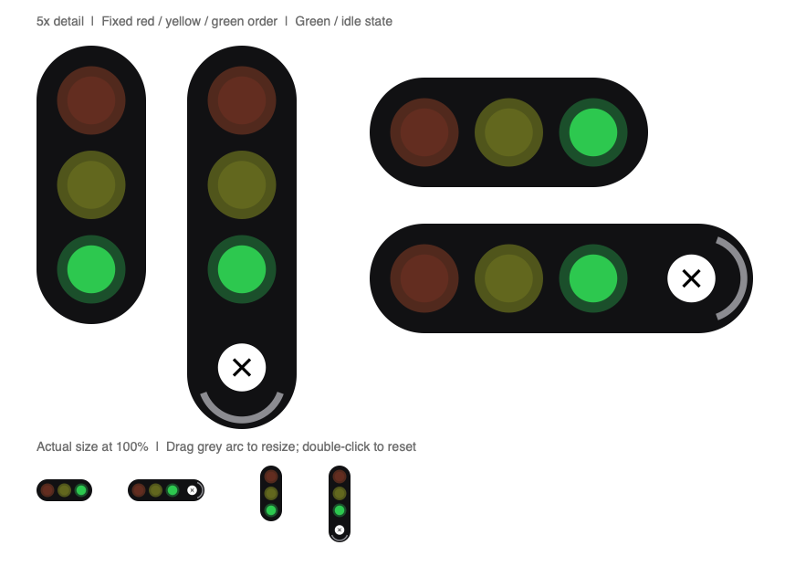

# Traffic light

A compact desktop indicator for session activity on macOS and Linux.

- 🟢 **Green** — finished or idle
- 🟡 **Yellow** — work is running, including parallel and background tasks
- 🔴 **Red** — waiting for permission or an answer



## Features

- **Native macOS support:** a floating, nonactivating AppKit panel with no Dock icon.
- **Compact controls:** a rounded capsule with a white Close button and a grey
  curved resize handle. The handle follows the right edge horizontally and the
  bottom edge vertically.
- **Proportional resizing:** drag the arc to scale from 75% to 200%; double-click
  it to reset to 100%. Your size is restored on the next launch.
- **Stable status display:** lamps always stay in red/yellow/green order. Inactive
  cores use 15% opacity, making the active color easy to distinguish.
- **Subtle motion:** 150 ms hover/reset transitions and 120 ms brightness fades,
  with reduced-motion support. Direct dragging and resizing remain immediate.
- **Session-linked lifecycle:** opens automatically with the application and exits
  after approximately five seconds without a valid status response.
- **Linux support:** GTK3/Cairo rendering and systemd user-service controls.

## Requirements

| Platform | Requirements |
|---|---|
| macOS | macOS 12 or later, a desktop login, and recent Apple Command Line Tools to compile the widget. Swift 6 is recommended. |
| Linux | Python 3.8 or later, GTK3, PyGObject, PyCairo, the GI/Cairo bridge, and systemd user services. |
| Both | The `opencode` CLI with local-plugin and event-hook support; the existing project baseline is version 1.15 or later. |

The compiled macOS widget needs no Homebrew, Python, or GTK installation.

## Installation

On macOS, install the compiler tools if needed:

```sh
xcode-select --install
```

From a desktop terminal:

```sh
git clone https://github.com/Minhaj401/opencode-traffic-light.git
cd opencode-traffic-light
./setup.sh
```

Setup builds the native executable on macOS. On Debian/Ubuntu-based Linux systems,
it installs missing dependencies through `apt`, requesting `sudo` when required:

```text
python3-gi python3-cairo python3-gi-cairo gir1.2-gtk-3.0
```

On other Linux distributions, install equivalent packages before running setup.

Setup also:

1. Links `traffic-light` into `~/.local/bin`; add that directory to `PATH` for daily use.
2. Installs the status plugin without rewriting your JSON/JSONC configuration.
3. Configures an on-demand per-user service using launchd or systemd.

**Quit and reopen all running application instances after installation.** Plugins
load at startup; restarting only the widget does not load an updated plugin.

```sh
opencode
curl --fail http://127.0.0.1:4390/status
# {"state":"green"} when idle
```

Keep the checkout in place: the CLI symlink points into it, and Linux runs the
Python source from it. If you move the checkout, rerun setup from its new location.

### Updating an existing installation

Run `./setup.sh` again, then restart all application instances, including persistent
backends. Setup stops the old widget and removes independent desktop-login startup;
the next application startup opens it on demand. Existing saved size and disabled
preferences are preserved.

## Daily use

| Command | Behavior |
|---|---|
| `traffic-light start` | Start the widget if it is stopped. |
| `traffic-light stop` | Stop the current widget without disabling future automatic starts. |
| `traffic-light restart` | Restart the widget. |
| `traffic-light status` | Show `running (PID)` or `stopped`; also the default command. |
| `traffic-light logs` | Show recent service output. |
| `traffic-light disable` | Stop the widget and block automatic startup. |
| `traffic-light enable` | Restore automatic startup and start the widget now. |

If `~/.local/bin` is not on `PATH`, use `./traffic-light` from the checkout.

### Move, resize, and close

- **Move:** drag the lamp area. Approaching a side edge rotates the widget vertically
  and snaps it to the edge; moving away returns it to horizontal.
- **Reveal controls:** hover or right-click. Moving away hides the controls unless
  a move or resize gesture is active.
- **Resize:** drag the grey arc along the widget's length. Double-click the arc to
  reset its size. Resizing does not rotate, move, or close the widget.
- **Close:** click the white circular button. A neutral gap separates its hit area
  from Resize. Dragging from Close onto the arc cancels closing.

At 100% scale, collapsed dimensions are **61 × 24 points**; expanded dimensions are
**84 × 24 points**. Vertical layouts transpose these dimensions. The resize arc has
extra end padding, a shorter sweep, and a slightly thicker stroke. A **2-point
neutral gap** at 100% scale separates the two controls.

On macOS, the widget starts below the menu bar/notch and follows the pointer across
displays. Controls work without activating the panel and expose accessibility
labels/actions. Motion respects macOS Reduce Motion and GTK's animation setting.

### Lifecycle and concurrent work

The first local backend process starts the widget. Additional processes reuse it;
they do not create duplicate windows or restart an existing widget.

Manually closing or stopping the widget keeps it dismissed for existing processes.
A new application startup or an explicit `start` can restore it. There is no
independent desktop-login startup or automatic crash-restart policy.

Pending and running task calls keep yellow active even when their parent session
reports idle. Completion, failure, and removal clear individual calls. Observed
child-session activity also counts after a background task returns. Red takes
priority over yellow whenever a session is waiting for input.

Lifecycle follows the backend process. With persistent `serve`, `attach`, or desktop
sessions, closing a terminal/window may leave the backend running. A manually
started widget with no backend exits after approximately five seconds.

## Configuration and installed files

Fresh installations use the automatically discovered plugin file at
`~/.config/opencode/plugins/traffic-light.js`. If configuration already references
`plugins/traffic-light/traffic-light.js`, setup updates that nested installation
instead of adding another copy.

The plugin destination uses `OPENCODE_CONFIG_DIR` when set, otherwise
`${XDG_CONFIG_HOME:-$HOME/.config}/opencode`. `OPENCODE_CONFIG` is checked for an
existing registration but does not change the destination. Use the same config
environment when installing and launching the application.

| Path | Purpose |
|---|---|
| `~/.local/bin/traffic-light` | CLI symlink into the checkout |
| `~/Library/Application Support/opencode-traffic-light/opencode-traffic-light` | Compiled macOS executable |
| `~/Library/LaunchAgents/com.opencode.traffic-light.plist` | macOS launchd service definition |
| `~/Library/Logs/opencode-traffic-light/` | macOS standard-output/error logs |
| `${XDG_CONFIG_HOME:-$HOME/.config}/systemd/user/opencode-traffic-light.service` | Linux service definition |
| `${XDG_STATE_HOME:-$HOME/.local/state}/opencode-traffic-light/preferences.json` | Saved scale |
| `${XDG_STATE_HOME:-$HOME/.local/state}/opencode-traffic-light/disabled` | Disabled-startup preference |

Saved scale uses the widget process's environment. Missing or invalid preferences
default to 100%; writes are atomic, and save failures do not stop the widget. On
macOS, use `enable` after `disable`; Linux also permits manual `start` while disabled.

## How status reaches the widget

```text
backend events → traffic-light.js → localhost HTTP → native or GTK widget
```

The plugin serves `GET /status` at `127.0.0.1:4390`, returning
`{"state":"green"}`, `{"state":"yellow"}`, or `{"state":"red"}`.
Widgets poll every 400 ms with a one-second timeout. Invalid responses retain the
last color during the five-second disconnect grace period.

One process owns the port; peers publish full snapshots every second through
`POST /heartbeat`. Snapshots expire after four seconds, and surviving processes
can take ownership without waiting for a new task event. Legacy `POST /event`
clients remain supported, but their lifetimes are not tracked; restart all backends
after updating to use the current protocol.

The endpoint is loopback-only and unauthenticated. Keep it local: other local
processes can read or change the displayed status.

## Troubleshooting

- **Widget does not appear:** restart the application after setup, then check
  `traffic-light status`, `traffic-light logs`, and the `/status` endpoint above.
  If automatic startup was disabled, run `traffic-light enable`.
- **Widget exits shortly after starting:** no valid backend response arrived for
  approximately five seconds. Check that the plugin loaded in a running backend.
- **Old appearance or task behavior:** rerun setup and restart all backends.
- **Linux display issue:** the supplied unit uses `DISPLAY=:0`. Adjust the installed
  unit for your desktop session if necessary, then reload/restart the user service.
- **No separate error lamp:** a stopped/failed session maps to green. Other active
  or waiting sessions may still determine the aggregate color.

## Development and testing

Shared checks require Python 3 and Node.js; tests isolate services and configuration
inside temporary directories.

```sh
sh -n setup.sh
sh -n traffic-light
python3 -B -m unittest discover -s tests -p 'test_*.py' -v
node --check traffic-light.js
node --experimental-vm-modules --test tests/plugin.test.js
git diff --check
```

On macOS, compile the widget and native tests without installing them:

```sh
(
  set -eu
  BUILD_DIR=$(mktemp -d "${TMPDIR:-/tmp}/traffic-light.XXXXXX")
  trap 'rm -rf "$BUILD_DIR"' EXIT
  MACOSX_DEPLOYMENT_TARGET=12.0 xcrun swiftc -O -parse-as-library \
    -warnings-as-errors opencode-traffic-light.swift -o "$BUILD_DIR/widget"
  xcrun swiftc -parse-as-library -warnings-as-errors -D WIDGET_TESTING \
    opencode-traffic-light.swift tests/macos-widget.swift -o "$BUILD_DIR/widget-tests"
  "$BUILD_DIR/widget-tests"
)
```

Append `--gui-smoke` to the test invocation to exercise temporary native panels.
Use `--render-previews "$BUILD_DIR"` instead to export transparent PNGs at 1x and
5x without opening a window. The Node VM warning is expected for isolated plugin tests.

CI runs shared checks on Ubuntu and macOS, with native compilation/tests on macOS.
Coverage includes task lifetimes, server takeover, installers/CLI commands,
geometry, raster colors, pointer targets, persistence, motion, and polling. The
Linux widget uses GTK/Cairo doubles in these tests. Physical desktop interaction,
Spaces/fullscreen behavior, actual GTK rendering, and Intel runtime execution
still need platform-specific verification.

## Uninstall

Stop and disable the service before removing its files:

```sh
traffic-light disable
```

On macOS:

```sh
rm -f "$HOME/.local/bin/traffic-light" \
  "$HOME/Library/LaunchAgents/com.opencode.traffic-light.plist" \
  "$HOME/Library/Application Support/opencode-traffic-light/opencode-traffic-light" \
  "$HOME/Library/Logs/opencode-traffic-light/stdout.log" \
  "$HOME/Library/Logs/opencode-traffic-light/stderr.log"
```

On Linux:

```sh
rm -f "$HOME/.local/bin/traffic-light" \
  "${XDG_CONFIG_HOME:-$HOME/.config}/systemd/user/opencode-traffic-light.service"
systemctl --user daemon-reload
```

For a fresh, automatically discovered plugin installation:

```sh
CONFIG_DIR=${OPENCODE_CONFIG_DIR:-${XDG_CONFIG_HOME:-$HOME/.config}/opencode}
rm -f "$CONFIG_DIR/plugins/traffic-light.js"
```

For a legacy nested installation, remove only its registration entry from your
configuration, then delete `traffic-light.js` and `package.json` from
`$CONFIG_DIR/plugins/traffic-light/`. Preserve other plugins and configuration.

Optionally remove the saved size and disabled-startup preference:

```sh
STATE_DIR=${XDG_STATE_HOME:-$HOME/.local/state}/opencode-traffic-light
rm -f "$STATE_DIR/preferences.json" "$STATE_DIR/disabled"
```

Restart all backends to unload the plugin; deleting files does not unload code
already running in another process.
